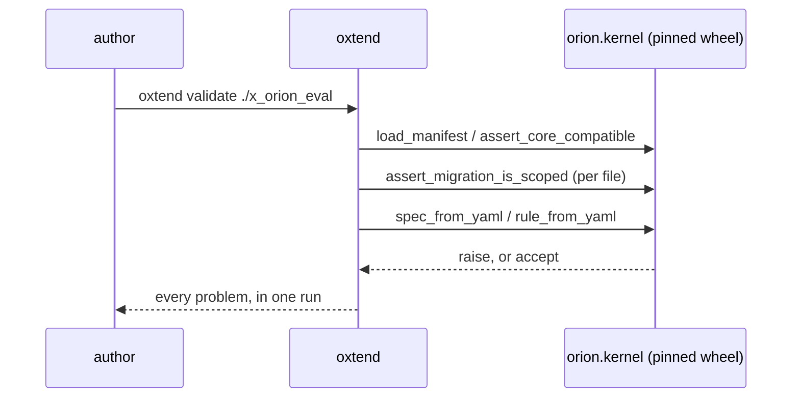

# 01 — `oxtend` Bundle CLI

## 1. Purpose

`oxtend` turns an extension or client source directory into the signed OCI artifact the
Orion Xtend kernel installs. It is the only supported way to produce a bundle, and it is
the gate that stops an extension being published against a core it cannot run on.

Derived from SPEC-67 §5.1 (the manifest contract) and §7.1 (the install lifecycle). The
reference implementation is `Orion Xtend/tools/oxtend-cli/oxtend.py` (231 lines), whose
own docstring lists contract tests, cosign signing, and a lockfile as
"production would add these" — this spec is those three plus the correction that the CLI
must not own any validation rule.

---

## 2. Scope

### In Scope (v1.0)

- `validate`, `lock`, `build`, `contract-test`, `sign`, `package`, `push`, `all`
- Vendoring the kernel's manifest model and migration gate from the pinned
  `orion-backend` wheel
- `bundle.json` as the single record of a bundle's identity, digest, and provenance
- Detached cosign signing over `bundle.json`; unsigned pushes refused by default
- `oxtend.lock` for rebuild determinism
- A published `oxtend:<version>` CI image with cosign baked in

### Out of Scope (v1.0)

- **Publishing to a Python index.** The wheel is a build artifact; the CI image is the
  distribution mechanism. Deferred until a consumer outside CI needs `pip install oxtend`.
- **`oxtend init` scaffolding.** Useful, but a template generator that drifts from the
  manifest schema is worse than no generator. Revisit once `schema_version` has been
  stable across two releases.
- **Bundle *installation*.** `oxtend` builds; the kernel installs. A CLI that can install
  would need core's database and would become a second install code path.
- **Egress enforcement of `capabilities.network`.** Declared and validated only, matching
  SPEC-67 §2.
- **Multi-arch images.** `busybox:stable` is multi-arch already; the bundle contains no
  compiled binaries, so per-arch builds buy nothing.

---

## 3. Dependencies

### 3.1 Upstream

| Dependency | What this spec uses |
|---|---|
| SPEC-67 §5.1 | The manifest contract — imported, not reimplemented |
| `orion.kernel.manifest` | `load_manifest`, `assert_core_compatible`, `MANIFEST_SCHEMA_VERSION` |
| `orion.kernel.migrations` | `assert_migration_is_scoped`, `read_migration_files` |
| `orion.kernel.digest` | `compute_bundle_digest` — both sides must hash identically |
| `orion.kernel.fields` / `.events` | `FIELD_TYPES`, `CORE_TOPICS` for contract checks |
| cosign ≥ 2.2 | Signing and verification |

### 3.2 Downstream

| Consumer | What it uses |
|---|---|
| `orion-extensions` CI | `validate → build → contract-test → sign → package → push` |
| `orion-client-dilmah` CI | The same chain for a `kind: client` bundle |
| `orion.kernel.registry` | `bundle.json` (digest, manifest) and `bundle.json.sig` |

---

## 4. Data Models

### 4.1 `bundle.json`

The bundle's identity document, and the only thing that is signed.

```json
{
  "scope": "x_orion_email",
  "version": "1.4.0",
  "kind": "extension",
  "digest": "sha256:…",
  "manifest": { "…the full validated manifest…" },
  "built_at": "2026-08-05T09:12:33.104512+00:00",
  "core_compat": ">=1.0,<2.0",
  "built_against_core": "0.7.0",
  "ui_remote": true
}
```

`digest` covers every file in the bundle except `bundle.json` itself and the cosign
artefacts, and is **path-sensitive** — renaming a file changes it. The reference
implementation hashes bytes only, so a rename is invisible to it.

### 4.2 `oxtend.lock`

```yaml
lock_version: 1
scope: x_orion_email
version: 1.4.0
manifest_digest: "sha256:…"      # of oxtend.yaml's raw bytes
core:
  declared_compat: ">=1.0,<2.0"
  resolved_version: "0.7.0"
ui:
  lockfile_present: true
  declared: {react: "^18.3.1"}
  resolved: {react: "18.3.1"}
locked_at: "2026-08-05T09:11:02+00:00"
```

`manifest_digest` hashes the *file*, not the parsed model: a comment or key-order change
is a change to the build inputs even when the parse result is identical.

---

## 5. API Contracts

### 5.1 Commands

| Command | Required args | Exit 1 when |
|---|---|---|
| `validate <dir>` | — | manifest invalid, declared path absent, migration out of scope |
| `lock <dir>` | — | manifest invalid |
| `build <dir>` | — | validation fails; `--require-lock` and the lock is stale |
| `contract-test <dir>` | `--core-version` | any symbol/endpoint/topic/field-type violation |
| `sign <dir>` | — | (exit 2) cosign absent or signing fails |
| `package <dir>` | `--registry` | (exit 2) no container CLI; image build fails |
| `push <dir>` | `--registry` | bundle unsigned without `--allow-unsigned` |
| `all <dir>` | `--registry` | any of the above |

### 5.2 Exit codes

| Code | Meaning |
|---|---|
| 0 | Success |
| 1 | The bundle is wrong — validation or contract failure |
| 2 | Tooling is missing — cosign, container CLI, or the pinned core wheel |

These are consumed by `orion-extensions`'s reusable workflow and are therefore public
API: changing what a code means is a breaking change.

---

## 6. Configuration

### 6.1 Environment

| Variable | Required | Purpose |
|---|---|---|
| `ORION_CORE_VERSION` | No | Overrides the detected core version (what `contract-test --core-version` sets internally) |
| `COSIGN_EXPERIMENTAL` | No | Passed through to cosign |
| `COSIGN_PASSWORD` | For `--key` | Local key file passphrase |

No config file. Every input is an argument or an environment variable, so a CI job's
behaviour is legible from its workflow file alone.

---

## 7. Behaviour

### 7.1 Delegation



`oxtend` contributes the *reporting* and the *ordering*; every rule belongs to the
kernel. `tests/test_validate_delegates.py` scans this repo's source for a duplicated
scope regex or migration gate and fails if one appears.

### 7.2 Why `contract-test` is a separate step from `validate`

`validate` answers "is this bundle well-formed?" — a pure function of the source tree.
`contract-test` answers "can this bundle run on core X?" — which needs core X importable.
Keeping them separate means an author can validate offline, and CI can matrix
`contract-test` across the bounds of the declared compat range without re-running the
cheap checks.

### 7.3 Signing scope

Only `bundle.json` is signed, because it carries the content digest. Tampering with any
bundle file changes the digest, which no longer matches the signed document. Signing
every file individually would multiply signatures by file count for no additional
guarantee.

---

## 8. Error Handling

| Error | Detection | Recovery | User impact |
|---|---|---|---|
| Manifest invalid | kernel `ManifestError` | exit 1, message names the field | Fix `oxtend.yaml` |
| Out-of-scope migration | kernel `MigrationSafetyError` | exit 1, names file + statement | Qualify the identifier |
| Declared path absent | `validate` path check | exit 1 | Fix the `provides` path — otherwise it installs and registers nothing |
| Stale `oxtend.lock` | `lock_is_current` | exit 1 under `--require-lock` | Re-run `oxtend lock` |
| Core symbol moved | `contract-test` AST + import | exit 1, names symbol and module | Update the extension or narrow `core.compat` |
| Undeclared topic in code | `contract-test` AST | exit 1 | Declare it, or stop emitting it |
| cosign absent | `shutil.which` | exit 2, install instructions | Install cosign — never a faked signature |
| Unsigned push | `is_signed` | exit 1 before any registry call | `oxtend sign`, or `--allow-unsigned` locally |

---

## 9. Security Considerations

- **No fabricated signatures.** Missing cosign is exit 2 with instructions, never a
  no-op success.
- **Keyless by default in CI.** The signer identity is the workflow, asserted by an OIDC
  token; there is no long-lived private key to leak. `--key` exists for local use.
- **Verification pins identity.** `verify_bundle` refuses to run without either `--key`
  or both `--identity` and `--issuer` — otherwise cosign answers "someone signed this",
  which is not the question.
- **Push is fail-closed.** Unsigned artifacts are refused, and the refusal is checked
  before any container CLI lookup so it cannot degrade into a different error on a
  machine without Docker.
- **Key material is gitignored** (`*.key`, `cosign.pub`).
- **`contract-test` does not execute extension code.** Static AST analysis only —
  running untrusted extension code inside the build tool would be a sandbox problem, not
  a validation one.

---

## 10. Integration Points

| Integration | Direction | Protocol | Detail |
|---|---|---|---|
| `orion.kernel.*` | Inbound | Python import | Pinned wheel; the pin is asserted in both repos |
| `orion-extensions` CI | Outbound | `oxtend:<version>` image | Reusable workflow, matrixed on compat bounds |
| OCI registry | Outbound | docker/podman | `orion-extensions/<scope>` or `orion-clients/<scope>` |
| `orion.kernel.registry` | Outbound | `bundle.json` + `.sig` | Digest read, signature verified on first install |

---

## 11. Technology Decisions

| Technology | Version | Rationale |
|---|---|---|
| `click` | ≥8.1 | Already the reference CLI's framework; sub-command groups and `ctx.invoke` chaining fit `all` exactly |
| `orion-backend` | ≥0.7,<1.0 | The vendored kernel. A range, not a wildcard: an unpinned core silently changes what `validate` accepts |
| cosign | ≥2.2 | Keyless OIDC in CI; the org registry already supports it |
| `ast` (stdlib) | 3.13 | Static contract analysis without executing extension code |
| `busybox:stable` | — | The bundle image must be able to extract itself; `scratch` cannot run a command |

---

## 12. Acceptance Criteria

### 12.1 Delegation

- [x] No scope regex and no migration gate appear in this repo's source (asserted by test)
- [x] `build` uses `orion.kernel.digest.compute_bundle_digest`; contains no `hashlib`
- [ ] The declared core pin contains the installed core version (CI-only; skips without dist metadata)

### 12.2 Build output

- [x] `bundle.json` carries `scope, version, kind, digest, manifest, built_at, core_compat`
- [x] The digest matches an independent recomputation
- [x] `orion.kernel.digest.verify_bundle_digest` accepts what `build` writes
- [x] A rebuild clears stale files from a previous build
- [x] Absent `ui/` is not an error

### 12.3 Contract

- [x] A nonexistent core symbol, module, endpoint, topic, and field type each fail
- [x] Path-parameter *names* need not match core's
- [x] `/x/<scope>/…` paths are not checked against core
- [x] Omitting `--openapi` warns rather than silently skipping
- [x] An out-of-range core is reported **and** the other checks still run

### 12.4 Sign / lock / push

- [x] `push` refuses an unsigned bundle, before any registry call
- [x] Missing cosign is a clear exit-2 error
- [x] A stale lock is detected under `--require-lock`
- [x] `build` ships `oxtend.lock` into the bundle
- [ ] Sign→verify round-trip against a real cosign binary (CI job `cosign-tests`)

### 12.5 End to end

- [ ] `oxtend all ./x_orion_eval --registry ghcr.io/ai3xtechnologies` then
      `cosign verify ghcr.io/ai3xtechnologies/orion-extensions/x_orion_eval:1.0.0`
      (needs a registry — the release-gate criterion from ORION-688)

---

## 13. Open Questions

### OQ-01 — Where the pinned core wheel comes from — OPEN

**Question:** `orion-backend` is not published to an index. CI currently checks out
`orion-knowledge-hive` at `vars.CORE_REF` and `pip install`s `./backend`.

**Options:**
1. Publish `orion-backend` to a private index (Artifact Registry / CodeArtifact) and pin
   a real version.
2. Keep the git checkout, pinned to a tag rather than a branch.

**Recommendation:** Option 1. Option 2's `CORE_REF` defaults to `main`, which means the
rules `oxtend` validates against can change without a commit in this repo — precisely
the drift the two-sided pin test exists to catch.

**Impact if deferred:** the pin test passes while `CORE_REF` floats, so it is weaker
than it looks. Documented in CI with an explicit "core ref not found" failure mode.

### OQ-02 — `busybox` base after ORION-671 — OPEN

**Question:** ORION-671 replaces volume-shared extraction with an init-container pull.
If nothing ever `docker run`s the bundle image again, `busybox` can become `scratch`.

**Recommendation:** Keep `busybox` for v1.0. `scripts/install_extension.sh` and the
dev/demo hot-install path still run the image. Revisit when the init-container is the
only consumer — noted as a follow-up in `package.py`, not silently changed.

---

## Changelog

| Version | Date | Author | Changes |
|---|---|---|---|
| 1.0 | 2026-08-05 | AI3X | Initial spec, derived from ORION-688. Adds the three steps the reference CLI's own docstring defers to production (contract tests, cosign, lockfile) and the delegation rule that the CLI owns no validation logic. |
